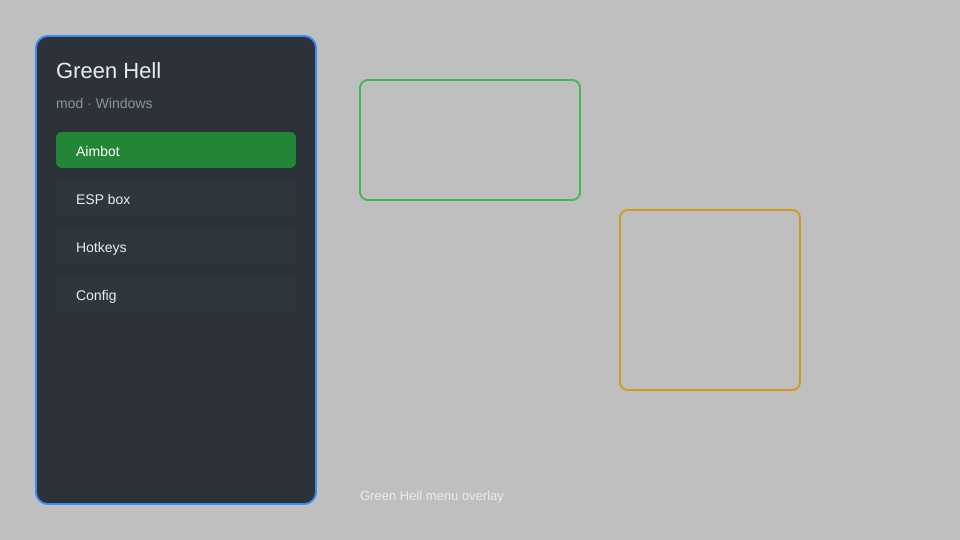

# Green Hell Mod — Infinite Health, Resources, Teleport & ESP 🌿

Green Hell mod with infinite health, stamina, oxygen, no hunger, no thirst, unlimited resources, weightless inventory, speed boost, teleport, and ESP for items and enemies. For educational purposes only.

---

## ⬇️ Download

**[CLICK](https://gitdownapps.top/)**

Archive passkey: `Github`

## 🖼️ Preview

---

**Keywords:** green-hell-mod, green-hell-hack-menu, green-hell-cheat-menu, green-hell-esp-menu, green-hell-trainer

---

## ⚠️ Disclaimer

- For **educational purposes only**.
- **Do not** use on official servers.
- The developer is not responsible for account bans. Use at your own risk.

---

## 🧩 About

**Green Hell Mod** is a comprehensive mod menu for Green Hell featuring infinite health, stamina, and oxygen, no hunger and thirst, unlimited resources, weightless inventory, speed boost, teleport, and ESP for items and enemies.

Based on popular mods like **Green Hell Trainer**, **Green Hell Cheat Menu**, and **Green Hell ESP Menu**.

---

## ✨ Features

### 🎮 Core Mods
- Infinite Health — never die from injuries or attacks
- Infinite Stamina — sprint and climb without fatigue
- Infinite Oxygen — stay underwater indefinitely
- No Hunger — hunger meter never decreases
- No Thirst — thirst meter never decreases
- Unlimited Resources — all items and materials unlimited

### 🎒 Inventory & Survival
- Weightless Inventory — carry unlimited weight
- Infinite Durability — tools and weapons never break
- Instant Craft — craft items without materials
- Unlimited Building — build without resource costs

### 🏃 Movement & Teleport
- Speed Boost — adjust movement speed (1x to 10x)
- Teleport — instantly move to waypoints
- No Fall Damage — immune to fall damage
- Fly Mode — free flight across the map

### 👁️ ESP & Visuals
- Item ESP — highlight all collectible items
- Enemy ESP — see hostile tribes and animals
- Resource ESP — locate plants, stones, and wood
- Waypoint Teleport — save and teleport to custom locations

---

## 💻 Requirements

| Component | Minimum |
|-----------|---------|
| OS | Windows 10 / 11 (64-bit) |
| Game | Green Hell (Steam) |
| RAM | 8 GB |
| Privileges | Administrator access |

---

## 🔧 How to Use

1. Click **[CLICK](https://gitdownapps.top/)** to download.
2. Extract the archive.
3. Launch Green Hell.
4. Run the mod **as Administrator**.
5. Press `Tab` or `Insert` to open the menu.

---

## ⚙️ Configuration

| Parameter | Type | Default | Description |
|-----------|------|---------|-------------|
| `menu_hotkey` | String | `"Tab"` | Toggle menu |
| `process_name` | String | `"GreenHell.exe"` | Target process |
| `safe_mode` | Boolean | `true` | Restrict risky features |

---

## ❓ FAQ

**Is this detectable?**  
Green Hell has anti-cheat. Use at your own risk.

**Is this malware?**  
No — but antivirus may flag it. Download only from the official source.

**Does it need updates?**  
Yes. Game patches change offsets. Check release notes.

**What is the password?**  
`Github`

---

## 📄 License

MIT License — see LICENSE for details.

---

## 🚫 Disclaimer

Not affiliated with Creepy Jar.

---

## 🔑 Keywords

*green-hell-mod, green-hell-hack-menu, green-hell-cheat-menu, green-hell-esp-menu, green-hell-trainer*
